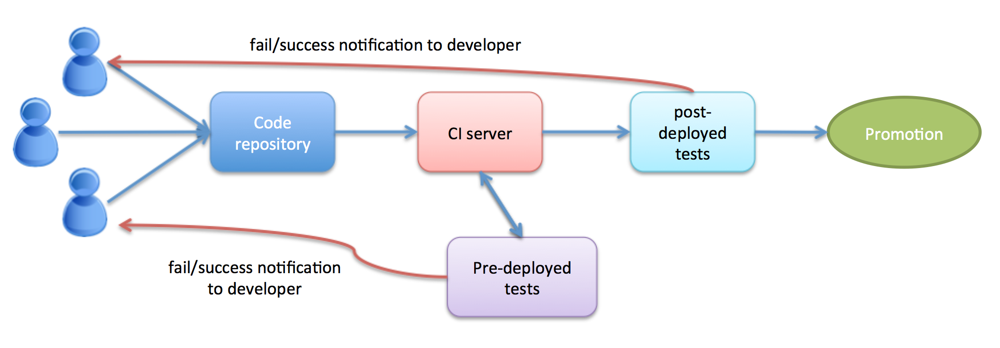

# The continuous way of web application development

*Prior  knowledge  - Programming, Web development, Basic git handling*

This text will give you a introduction to terms like Continuous Integration (CI), Continuous Development and Continuous Deployment. It will try to explain what these terms means, how they differs and why they are main concepts in the [devOps](https://en.wikipedia.org/wiki/DevOps) community.

One common project model in older software development was the [waterfall model](https://en.wikipedia.org/wiki/Waterfall_model). It is a sequential project model. Every part in the development was made as isolated steps. First all the requirements were collected, when this was documented and done - then the planning phase started, then the development and when the code was ready a integration phase begun and so on.

Not only was it hard to introduce changes during the project, the integration was often experienced as a game, nobody was sure it would work and how much time (and money) needed to be spend getting the application running in production. Code that has been isolated for month should suddenly run together and hopefully everything in the application will work. Of course that wasn't the case in most projects.

Since the code had grown isolated problems and bugs was implemented early in the code the teams didn’t found them until the big integration. This integration phase often have a tight time frame with a promised release date. Problems that could had been solved easy become more complex and hard to fix and no one had the whole picture of the complex software. A lot of stressed work is to be done and there will be a big risk that bugs find their way out to production.

Today we see more project that are using a more iterative or [agile software developing](https://en.wikipedia.org/wiki/Agile_software_development) model. We have realized that software ideas change during the process and we need to handle this fast. We have also realized that integration should be done continuously. We must found eventual problem and bugs as soon as possible in the process. This is what Continuous Integration (CI) is all about.

## A Continuous Integration workflow

[The term has been around for a while](https://en.wikipedia.org/wiki/Continuous_integration) and been used in the [eXtreme Programming (XP)](https://en.wikipedia.org/wiki/Extreme_programming) community before.

A team with developers produce different chunk of code handling different features of the application. The applications main code should live in a shared repository where developers push or merge code **several times a day**. This will start a integration process where the code should validates against static analyzes (like code hinting) and run tests. That will catch some of the bugs and problem very early in the process and force the developers to fix this before it grows to a bigger problem.

As you see CI does not only refers to integration of code. In the CI pipeline you should build and test your code within the development environment. Imagine we have a couple of developers writing code for a specific application. They all share the same main “master branch” where the application code for production should live. The may all produce their code commit and push directly to the master. A common way may be that each developer work on a specific task, a feature, a fix and so on and have this work in a own branch. When the developer is confident about her/his code the branch is merge into the master branch which is the first step in the CI pipeline.

### A CI pipeline
When working in a CI inspired project you should set up a pipeline or workflow. Below is a suggestion taken from the book ["The devops 2.0 toolkit"](https://leanpub.com/the-devops-2-toolkit) by Viktor Farcic. To support this pipeline you probably will tools like [Git](https://git-scm.com/)/[GitHub](github.com) for versioning  (step 1) and CI servers (step 2-5) like [Jenkins](https://jenkins.io/) or [Travis](https://travis-ci.org/).

1. **Pushing/merging**
As said before the developers are working either in different branches and merge the commits together or all developers push their commits directly to the master to integrate the code. This should be done several times a day to find problems as fast as possible. This is handle by your version control system.

2. **Static Analysis**
This means checking code for syntax error, runs some code hinting to check that the code standard is meet (optional). This is of course something that the developer should check by her/himself but the CI pipeline should have some automated tool that guarantee that code not following the correct standard will end up in the shared repository.

3. **Pre-deployed tests**
In this step runs all types of test that don´t need code to be deployed to a server. This is mainly [unit tests](https://en.wikipedia.org/wiki/Unit_testing) or maybe some [functional tests](https://en.wikipedia.org/wiki/Functional_testing). Tests running in this steps should be easy to write and fast to execute.

4. **Packing and deploying to test environment**. In this step code files should be compressed and minified (or maybe turn into WAR- or JAR-files). Static stuff should be send to your CDN for faster presentation. If you are working with [containers](./containers.md) the container should be created with all it dependencies required to run your application. The container is then deployed to a test environment.

5. **Post-deployed testing**
When your application is deployed to the testing environment you can run test that ensure that the integration is OK, including functional, integration and performance tests. In the CI you also may have some manual testing (QA- Quality Assurance) of the application.

## Go further - Continuous Delivery and Continuous Deployment
As CI allows manual validations of the application Continuous Delivery aim to take this a step further and automate all validations and testing, meaning no manual QA-phase. The main thing is to get the code ready for production, maybe not putting it in production but have confidence it will work. The application **can** be put in production. Think of it as a "one button push deployment". Not putting it directly in production could depends on maybe marketing ask to wait for a bigger release or collect many feature and release these in groups.

Going to Continuous Deployment means that the code will be put in production the moment it passed all validation and tests. This is also done automated. Maybe some tests (the post-production tests) need to be rerun into the production environment and the system have some kind of feature to rollback changes. This is often done by having a proxy in front of the application that could be changed between different versions of the main application. After a while (when you are sure the application works as excepted) you can remove old releases.

Talking about release strategies is out of scope of this text but there are techniques in this step that allow things like "feature toggles" ([blue/green deployment](http://martinfowler.com/bliki/BlueGreenDeployment.html)). That means we can turn off and on features in the application to test them in the wild, maybe for a specific kind of users.

## Conclusions
This text just gives a short introduction to the subject. Going into continuous integration can be a big and hard step for many companies. Going all the way to continuous deployment is even harder. But they are important ideas in a modern software company and there are important things to think about in every case.

### Fast notifications
There some thing to remember when walking through this pipeline. First of all - we have this pipeline to ensure that we get the feedback needed about problems as fast as possible. This will mean that if we got some problem/error in one of the step the automated system the developers must be notified as soon as possible to fix the problem. If its just a simple problem the responsible developer can fix it self and redo the build process, if its a bigger problem more developers in the team should concentrate to fix the problem before implementing more features. The main thing is that the pipeline should support fast notifications if some step fails, often trough messages like mail or [slack](https://slack.com/).

#### Automate all things!
Always try to automate all things that could be automated! This will guarantee that the process is always treated the same way to avoid manual errors. This will also take care of the documentation. A script that automate some thing is also a documentation that tells how the process is done. If you do things manual you are responsible of writing and update with changes. Not many developers like writing documentation documents.

What we also must know is that there will never be silver bullets in software development. The complexity of the applications, projects, teams, technology and so on will always be different.
